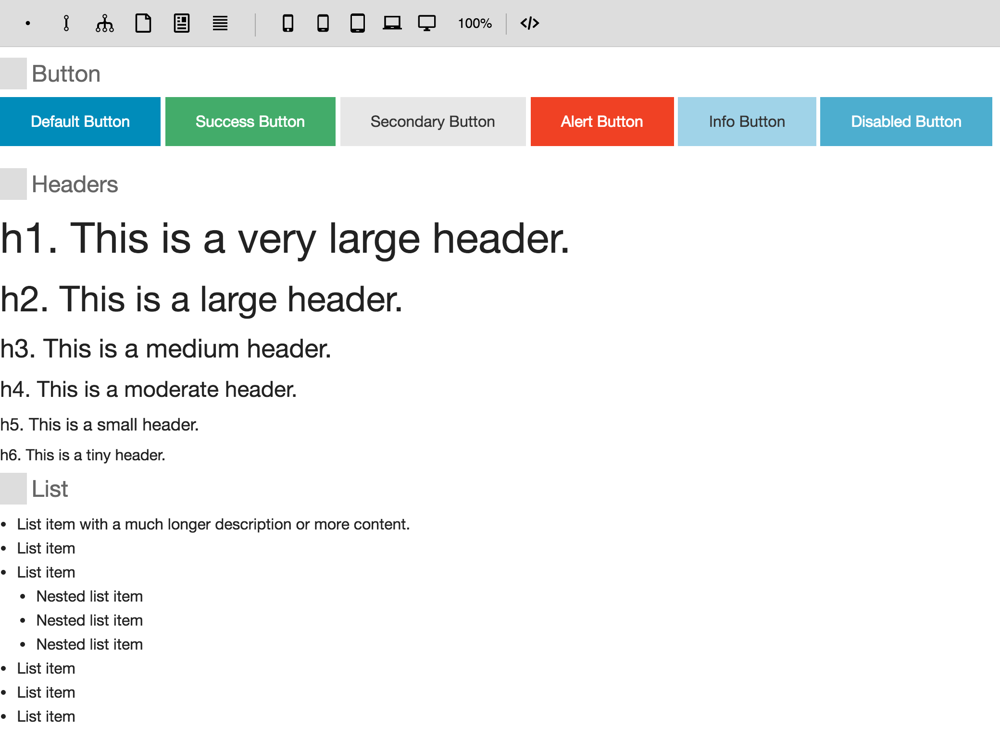
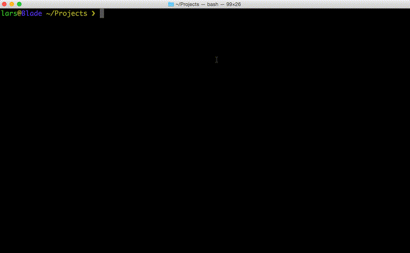

# Component Styleguide

## Introduction

Simple styleguide framework. Install [component-styleguide](https://www.npmjs.com/package/component-styleguide) into your styleguide project, and it will stay out of your way. It's inspired by [http://patternlab.io](http://patternlab.io), but is fundamentally different. And, I would say, much more flexible.

## What is it?

Simple. You start out with a blank project. Your codebase contains just your own HTML templates and CSS stylesheets (and JavaScript if you want to). Put your files in some (configurable) directories, and there you have it.

See [component-styleguide-example](http://github.com/webpro/component-styleguide-example) for an example setup (you could use this project as a boilerplate), and a [live running example](http://component-styleguide-example.webpro.nl).

You can use it as a development server, and/or host it somewhere as a Node service.

## Example Screenshot

## Installation Steps

### 1. Install component-styleguide

    npm install component-styleguide --save

### 2. Structure

Create a directory structure, like this:

    .
    ├── components
    │   ├── atoms
    │   ├── molecules
    │   └── organisms
    └── data

### 3. Start

Write a minimal Node script (say `index.js`):

    var styleguide = require('component-styleguide');
    styleguide();

And run it: `node index.js`.

The styleguide is now running at [http://localhost:3000](http://localhost:3000).

#### 4. Build Components

Put templates and partials in the `components` directory and subdirectories (e.g. `atoms`, `molecules`, and `organisms`, but this is not mandatory). They should be files ending with `.html` and contain HTML snippets or Handlebars templates.

Here is a screencast of a quick & dirty installation:

And here's the result in the browser:

## Configuration

You can work with the default settings straight away, but you might want to customize some things. By default:

* Use `atoms`, `molecules`, and `organisms`, `templates` and `pages`, and they will show up in that order and as an icon. But you can name the directories any way you like.
* The extension `html` is expected, but you can configure any other extension.
* If you need [stub data](#stub-data) to feed to your templates, you can put `*.json` files in the `/data` directory.
* To use your stylesheets, put filenames in the `stylesheets` array, and make sure these files are/end up in the `/compiled` directory (also configurable).
* Same for `scripts`.

To specify alternative settings (showing default values here):

    styleguide({
        components: './components',
        ext: 'html',
        data: './data',
        staticLocalDir: './compiled',
        staticPath: '/compiled',
        stylesheets: ['stylesheet.css'],
        scripts: ['bundle.js'],
    });

## Command Line Interface

Alternatively, the styleguide can be started directly from the CLI without any scripting involved:

    styleguide

Here's an example with default settings:

    styleguide --components components --ext html --data data

You would need to either install it globally (i.e. `npm install -g component-styleguide`), or use it from a `package.json` [script](https://docs.npmjs.com/misc/scripts).

## Details

### Handlebars

[Handlebars](http://handlebarsjs.com) is used as the template engine.

### Partials

Each template is automatically registered as a partial (e.g. you can reuse your `{{> atoms/component}}` in templates).

### Stub data

All "data" files are concatenated into one "context" for the templates. E.g. `users.json` containing `[]` and `profile.json` containing `{}` will result in context data for the templates:

    {
       "users": [],
       "profile": {}
    }

Now, the `{{#users}}` collection can be iterated over in any template.

### CSS & JS

You can organize and compile your CSS and JavaScript in any way you want, as long as they end up in e.g. `/compiled` (the `staticLocalDir`) to serve them with the components. I think it's a good idea to work directly in this folder, or compile SASS/LESS/... source files into e.g. `compiled/stylesheet.css` and configure it as `stylesheets: ['stylesheet.css']`.

## Doh, yet another styleguide framework!?

Since I didn't like the approach of most styleguide tools, I created something I actually enjoy to use. It stays out of my way, so I can focus on the components.

Some solutions generate a styleguide from comments in the CSS. But I like to have separate templates, maybe some stub data, maybe some JavaScript. Other tools provide a boilerplate project, which may work fine at first, but it is hard to change or update the underlying styleguide framework later on.

As a Node.js dependency, features and bugs can be dealt with separately. You only need to update the `component-styleguide` dependency (`npm update`), without having to fork a repository and/or merge upstream changes, and it will happily continue to just serve your templates and static assets. Simple.

## License

[MIT](http://webpro.mit-license.org)
